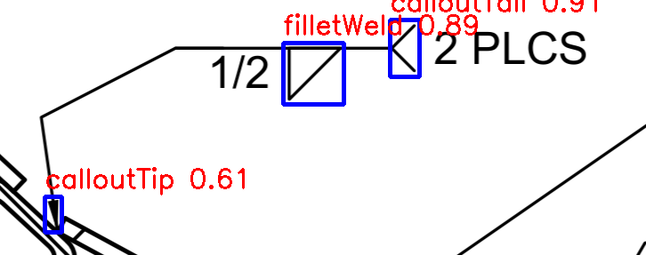
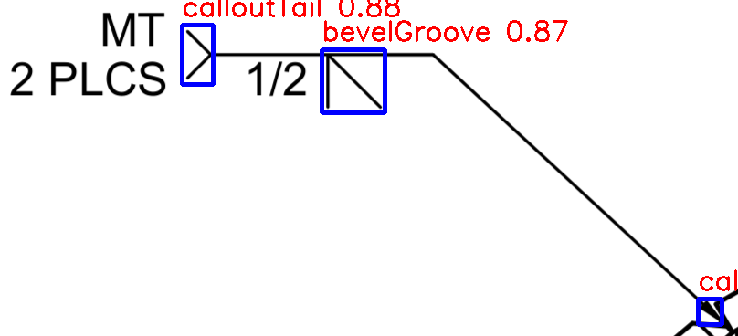
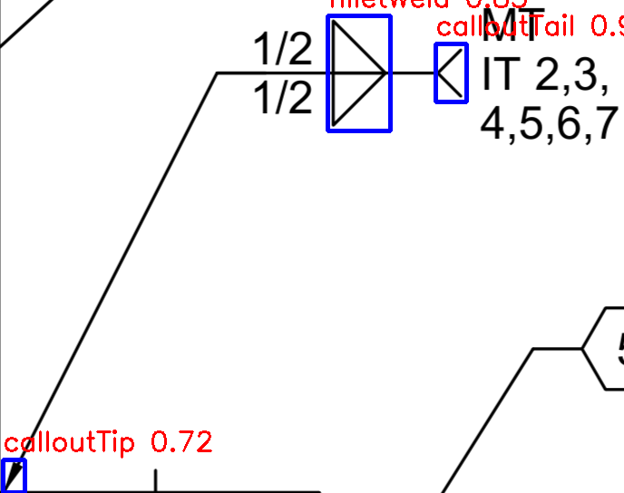
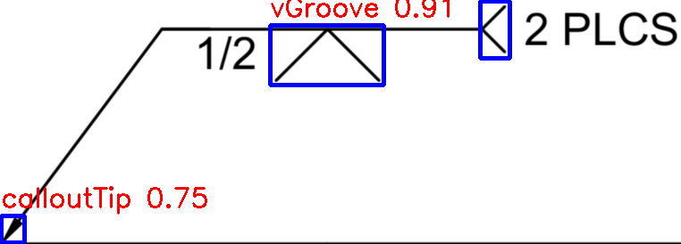
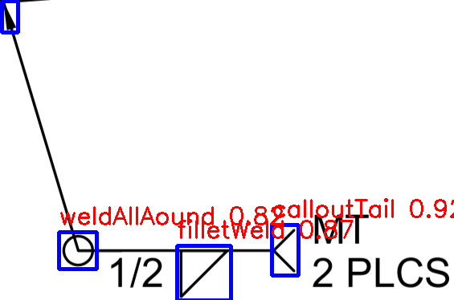

# Weld Symbol Identifier

This repository contains a YOLO-based model for identifying weld symbols in engineering drawings. The model is trained to detect 16 distinct weld types commonly found in fabrication and drafting workflows. These weld types were taken from the document: [Weld Symbols in Engineering Drawings](https://www.mplso2.com/wp-content/uploads/2021/08/Welding-Symbol-Chart.pdf)

This model is intended to be used in conjunction with a weld symbol annotation tool, such as [Label Studio](https://labelstud.io/). This is a base model that can be used to identify weld symbols in images, but it is not optimized for all use cases. The model was built using [Ultralytics](https://ultralytics.com/) and [YOLOv8](https://github.com/ultralytics/yolov8). 

## Supported Weld Types

The model detects the following weld symbols (code references in camelCase):

- **Backing Spacer** (`backingSpacer`)
- **Bevel Groove Weld** (`bevelGroove`)
- **Callout Tail** (`calloutTail`)
- **Callout Tip** (`calloutTip`)
- **Convex/Concave Modifier** (`convexConcave`)
- **Field Weld Symbol** (`fieldWeld`)
- **Fillet Weld** (`filletWeld`)
- **Flare Bevel Groove Weld** (`flareBevelGroove`)
- **Flush/Flat Modifier** (`flushFlat`)
- **J-Groove Weld** (`jGroove`)
- **Melt-Through Symbol** (`meltThrough`)
- **Plug Weld** (`plugWeld`)
- **Square Groove Weld** (`squareGroove`)
- **V-Groove Weld** (`vGroove`)
- **Weld-All-Around Symbol** (`weldAllAround`)

---

## Full Setup Guide (No Prerequisites Assumed)

### 1. Install Python
Ensure **Python 3.10+** is installed. Check version:
```bash
python --version
```
If not installed, download from [Python.org](https://www.python.org/downloads/).

---

### 2. Install Git
Make sure Git is available to clone the repository:
```bash
git --version
```
If not, install from [Git SCM](https://git-scm.com/downloads).

---

### 3. Create a Virtual Environment
Recommended for dependency isolation:
```bash
python -m venv weldCalloutEnv
```

Activate it:  
- **Windows (PowerShell):**
  ```bash
  weldCalloutEnv\Scripts\Activate
  ```
- **macOS/Linux:**
  ```bash
  source weldCalloutEnv/bin/activate
  ```

---

### 4. Clone the Repository
```bash
git clone https://github.com/RylanBosquez/weldCalloutIdentifier.git
cd weldCalloutIdentifier
```

---

### 5. Install Dependencies
```bash
pip install --upgrade pip
pip install -r requirements.txt
```

---

## Usage

Run inference on example images:
```bash
python main.py
```

The script will:
- Load each image from `./assets/weldExamples`
- Run YOLOv8 inference
- Apply non-maximum suppression to filter overlapping boxes
- Display the image with bounding boxes and weld type labels

---

## Example Images

#### Tip, Tail, and Fillet Weld


#### Tip, Tail, and Bevel Groove Weld


#### Tip, Tail, and Fillet Weld Both Sides


#### Tip, Tail, and V-Groove Weld


#### Tip, Tail, Fillet, and Weld-All-Around


Add your test images to the `./assets/weldExamples` folder.

---

## Applications

- Automated annotation in CAD workflows  
- Symbol classification for engineering documentation  
- Integration with Label Studio or other annotation tools  
